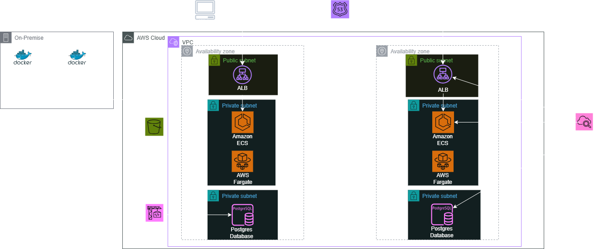

# Refactor Cloud Migration – VM to AWS Fargate + RDS

Migrate a small legacy Docker Compose app (Node/Express + PostgreSQL) off a single VM into a managed, scalable AWS stack with data preserved in Amazon RDS. All infrastructure is provisioned with Terraform and the database migration is automated with CodeBuild.

## Overview

Legacy setup (on a Linux VM):

- Node.js/Express API  
- PostgreSQL 15 via docker-compose  

Refactored target on AWS:

- Amazon ECS Fargate (private subnets) behind an Application Load Balancer  
- Amazon RDS for PostgreSQL (private, no public access)  
- HTTPS with ACM certificate and Route 53 (justindemo.click)  
- S3 migration bucket + CodeBuild job to restore a pg_dump into RDS  
- App updated to use environment variables and SSL when talking to RDS  

## Architecture

Main components:

- VPC across 2 AZs with public (ALB) and private (ECS/RDS) subnets  
- ALB (HTTPS) → ECS Fargate service → RDS PostgreSQL  
- S3 uploads bucket (optional) and S3 migration bucket for app.dump  
- Secrets Manager for DB credentials  
- CodeBuild in the VPC to download dump from S3 and run pg_restore into RDS  

## Repo Layout

    .
    ├── bootstrap-backend/
    │   ├── main.tf
    │   ├── outputs.tf
    │   └── variables.tf
    ├── infrastructure/
    │   ├── backend.tf
    │   ├── main.tf              # Root Terraform config
    │   ├── outputs.tf
    │   ├── terraform.tfvars     # Local-only (gitignored); see terraform.tfvars.example
    │   ├── variables.tf
    │   └── modules/
    │       ├── acm/
    │       ├── compute/
    │       ├── database/
    │       ├── ecr/
    │       ├── migration_bucket/
    │       ├── monitoring/
    │       ├── network/
    │       ├── route53/
    │       ├── s3_uploads/
    │       └── security/
    └── legacy-mono/              # Legacy VM stack
        ├── app/
        │   ├── app.migrated.js   # Updated: AWS/RDS/SSL-aware entrypoint 
        │   ├── app.original.js
        │   └── Dockerfile
        ├── data/db
        ├── uploads
        ├── .env.legacy
        ├── app.dump
        └── docker-compose.yml

## Legacy Stack (VM)

docker-compose.yml:

    services:
      db:
        image: postgres:15
        environment:
          POSTGRES_USER: appuser
          POSTGRES_PASSWORD: apppass
          POSTGRES_DB: appdb
        ports:
          - "5432:5432"

      app:
        build: ./app
        env_file: .env.legacy
        ports:
          - "3000:3000"
        depends_on:
          - db

Run on the VM:

    docker compose up -d
    curl http://localhost:3000/notes

Seed some notes records here; they will later appear in RDS.

## Cloud Deployment (Terraform)

From the `infrastructure/` directory:

    cd infrastructure
    terraform init
    terraform apply

Terraform creates:

- VPC, subnets, route tables, Internet Gateway, NAT Gateway  
- Security groups for ALB, ECS, and RDS  
- ACM certificate and Route 53 records for justindemo.click  
- RDS PostgreSQL in private subnets with credentials in Secrets Manager  
- ECS Fargate service using an image in ECR  
- CodeBuild project for DB restore from S3  

## Configuration

Copy the example variables file and fill in your own values:

    cd infrastructure
    cp terraform.tfvars.example terraform.tfvars
    # edit terraform.tfvars with your real AWS details

## Data Migration

On the VM, dump the legacy Postgres database:

    docker exec -it <db-container-name> pg_dump \
      -U appuser -d appdb -Fc -f /tmp/app.dump

    docker cp <db-container-name>:/tmp/app.dump ./app.dump

Upload the dump to the migration bucket:

    aws s3 cp ./app.dump s3://<MIGRATION_BUCKET>/db/app.dump
    # example: s3://justindemo-migration-bucket/db/app.dump

Trigger the CodeBuild project (via console or CLI). It:

- Downloads db/app.dump from S3  
- Reads the DB password from Secrets Manager  
- Runs pg_restore into RDS  
- Skips restore if the notes table already exists (idempotent)  

## App Changes (Before vs After)

### app.original.js

- Assumes local Postgres (localhost, no SSL) and a static password  
- Intended only for the VM/docker-compose environment  

### app.migrated.js (updated for AWS)

- Reads DB host, port, name, user, and password from environment variables (wired by Terraform)  
- Prefers DB_PASSWORD (from Secrets Manager) but falls back to DB_PASS for local/docker-compose use  
- Enables SSL when DB_HOST is not localhost, which is required by RDS from ECS  
- Supports both local storage and S3 for file uploads (via Multer and AWS SDK v3)  

## Verification

After Terraform, image push, S3 upload, and CodeBuild restore:

    curl -i https://justindemo.click
    curl -i https://justindemo.click/notes

Expected:

- `/` returns a JSON health payload like `{"ok": true, ...}`  
- `/notes` returns the same rows that were originally created on the VM’s Postgres (now served from RDS via ECS Fargate)  

Optional direct verification in RDS:

    SELECT id, body FROM notes ORDER BY id DESC;

## Tech Stack

- AWS: VPC, ALB, ECS Fargate, RDS (PostgreSQL), S3, CodeBuild, Secrets Manager, Route 53, ACM, CloudWatch Logs  
- App: Node.js, Express, PostgreSQL, Multer, AWS SDK v3  
- Infra: Terraform, Docker, Docker Compose
